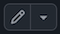

# Welcome to CHM/MAS/PHYXXX: Title of Module

This is the landing page of your module; the first page that the students will see when they click through to your notes.

At the very least, you will need to edit this page to display the correct module code and title above, and to replace this text with something more appropriate for your module.

To edit this landing page, go to [https://github.com/Sheffield-MPS/JupyterBookTemplate](https://github.com/Sheffield-MPS/JupyterBookTemplate). From there, you have two choices:
1. If you're familiar with git and github, you can clone the repository and make edits, commit, then push as you usually would for a git repo; or   
2. Click on `welcome.md` in the left-hand menu, then click on the little pen icon  which is toward the upper right of the page. Doing so will start the editor mode on github. Once you've made the edits you need, click on the green "Commit Changes". You can add a commit message and description of your changes in the pop-up box, if you want. Ensure "Commit directly to the main branch" is selected, then click on "Commit changes".

As well as changing the module code and title, it's a good idea to include general module information on this page. I've added some sections below as guidance, but feel free to remove or add to them as you see fit.

You should also edit the "title" and "author" fields in the `_config.yml` file accordingly (by following either of the above two methods). 

Finally, you will definitely want to go through your notes to check that they have been rendered correctly. Common things to look out for are:
* **Any symbols that are highlighted in bright red.**\
These are symbols that the converter didn't recognise (often because they're defined using `\newcommand` in LaTeX).
* **Images that could not be found.**\
This is usually because the filename used in the markdown no longer matches the name of the file in the `Images` directory. Pay particular attention to upper/lower case letters.
* **Failed `\begin{align}`s.**\
These should be replaced with `\begin{equation}`s.
* **Incorrectly titled lectures in the left-hand menu.**\
If you have multiple lecture markdown files (possibly converted from multiple LaTeX files), then these should appear as "Lecture 1", "Lecture 2" etc. in the left-hand menu. What can happen if your lecture notes start with a section (indicated with two hashes) instead of a title (indicated with one hash), is that the "Lecture 1"s etc get replaced by the section name. If that's happening, either remove one hash from the first section, or just add an appropriate title at the start. If you want anything other than "Lecture 1" etc to appear in the left hand menu, then edit the "title" fields in the `_toc.yml` file.  

And now, those sections I promised...

## Contact time
This module consists of X 50-minute lectures/X hours of workshops/X problems classes. Barring any unforeseen events, lectures will take place in-person at:
* X am/pm on Yday in Lecture Theatre Z; and
* x am/pm on yday in Lecture Theatre z.

Should anything happen that prevents an in-person lecture, then live lectures will proceed online via Blackboard Collaborate Ultra. Full instructions on how to access online lectures will be provided should the need arise. All lecture notes and slides have already been made available on Blackboard, and recordings will be made available after each lecture (please allow a few hours for the recordings to be processed). Bear in mind, however, that the lecture recordings often fail to capture what is written on the blackboard, so please avoid non-attendance assuming that you can watch the recordings later and still get the same experience.

## Assessments
There are X assessments for this module:
* **Homework worth X percent of the final grade.** This will be made available during week X and is due in week X. Please see the Blackboard page of the module for more details, including precise submission deadlines; and
* **A presentation worth X percent of the final grad.** Please see the Blackboard page of the module for mode details.
* **A final X-hour exam** Please see the Blackboard page of the module for mode details.

## Office Hours
My office is X in the Dainton/Hicks building. My office hours are:
* X am/pm on Yday; and
* x am/pm on yday.
While you can arrive unannounced during my office hours, it’s best to email beforehand to confirm. If you wish to see me outside my office hours, you’ll need to email me to arrange a suitable time. If you come to my office outside my office hours, please don’t be offended if I ask you to either return during my office hours, or to arrange an appointment.

